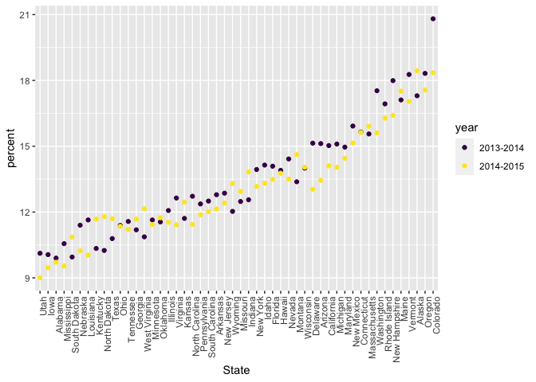

Strings and Factors
================
2022-10-18

## String vectors

``` r
string_vec = c("my", "name", "is", "jeff")

str_detect(string_vec, "jeff") #Detect "jeff" in your vector of strings
```

    ## [1] FALSE FALSE FALSE  TRUE

``` r
str_detect(string_vec, "a") # Looks for anything in string that contains "a"
```

    ## [1] FALSE  TRUE FALSE FALSE

``` r
str_replace(string_vec, "jeff", "Jeff")
```

    ## [1] "my"   "name" "is"   "Jeff"

``` r
string_vec = c(
  "i think we all rule for participating",
  "i think i have been caught",
  "i think this will be quite fun actually",
  "it will be fun, i think"
  )

str_detect(string_vec, "i think") # Find something that contains "i think"
```

    ## [1] TRUE TRUE TRUE TRUE

``` r
str_detect(string_vec, "^i think") # Find something that STARTS with "i think"
```

    ## [1]  TRUE  TRUE  TRUE FALSE

``` r
str_detect(string_vec, "i think$") # Find something that ENDS with "i think"
```

    ## [1] FALSE FALSE FALSE  TRUE

You can designate a list of characters that will count as a match.

``` r
string_vec = c(
  "Y'all remember Pres. HW Bush?",
  "I saw a green bush",
  "BBQ and Bushwalking at Molonglo Gorge",
  "BUSH -- LIVE IN CONCERT!!"
  )

str_detect(string_vec,"Bush") # Only detects Bush with capital B
```

    ## [1]  TRUE FALSE  TRUE FALSE

``` r
str_detect(string_vec,"[Bb]ush") # Detects bush with a capital or lowercase b
```

    ## [1]  TRUE  TRUE  TRUE FALSE

You don’t have to list these; instead, you can provide a range of
letters or numbers that count as a match.

``` r
string_vec = c(
  '7th inning stretch',
  '1st half soon to begin. Texas won the toss.',
  'she is 5 feet 4 inches tall',
  '3AM - cant sleep :('
  )

str_detect(string_vec, "^[0-9][A-Z]") 
```

    ## [1] FALSE FALSE FALSE  TRUE

``` r
str_detect(string_vec, "^[0-9][a-zA-Z]") 
```

    ## [1]  TRUE  TRUE FALSE  TRUE

The character `.` matches anything.

``` r
string_vec = c(
  'Its 7:11 in the evening',
  'want to go to 7-11?',
  'my flight is AA711',
  'NetBios: scanning ip 203.167.114.66'
  )

str_detect(string_vec, "7.11") # . means anything can be between a "7" and "11", but must have something
```

    ## [1]  TRUE  TRUE FALSE  TRUE

Some characters are “special”. These include `[` and `]`, `(` and `)`,
and `.`. If you want to search for these, you have to indicate they’re
special using `\`. Unfortunately, `\` is also special, so things get
weird.

``` r
string_vec = c(
  'The CI is [2, 5]',
  ':-]',
  ':-[',
  'I found the answer on pages [6-7]'
  )

# str_detect(string_vec, "[") Error message expects you to put something in the bracket and indicate a range

str_detect(string_vec, "\\[") # Put \\ to search for a special character
```

    ## [1]  TRUE FALSE  TRUE  TRUE

``` r
str_detect(string_vec, "\\[0-9]") 
```

    ## [1] FALSE FALSE FALSE FALSE

## Why factors are weird

Factors are the way to store categorical variables in R. They can take
on specific levels (e.g. male and female) which are usually presented as
characters but are, in fact, stored by R as integers. These integer
values are used by functions throughout R – in making plots, in
organizing tables, in determining the “reference” category – but most of
the time are hidden by easier-to-read character string labels. This
close relationship to strings, when in fact there is a lot of added
structure, is why factors can be so confusing.

``` r
factor_vec = factor(c("male", "male", "female", "female"))

as.numeric(factor_vec) # Male = 2 
```

    ## [1] 2 2 1 1

``` r
factor_vec = fct_relevel(factor_vec, "male") # Relevel male as the first level

as.numeric(factor_vec)
```

    ## [1] 1 1 2 2

The previous code also illustrates coersion: forcing a variable from one
type (e.g. factor) to another (e.g. numeric). Understanding how R
coerces variables is important, because it sometimes happens
unintentionally and can break your code or impact your analyses.

## NSDUH

``` r
nsduh_url = "http://samhda.s3-us-gov-west-1.amazonaws.com/s3fs-public/field-uploads/2k15StateFiles/NSDUHsaeShortTermCHG2015.htm"

table_marj = 
  read_html(nsduh_url) %>% 
  html_table() %>% 
  first() %>%
  slice(-1)
```

There are a few steps we need to implement to tidy these data.

``` r
data_marj = 
  table_marj %>%
  select(-contains("P Value")) %>%
  pivot_longer( 
    -State,
    names_to = "age_year", 
    values_to = "percent") %>%
  separate(age_year, into = c("age", "year"), sep = "\\(") %>%
  mutate(
    year = str_replace(year, "\\)", ""),
    percent = str_replace(percent, "[a-c]$", ""), # Replace a,b,c with nothing
    percent = as.numeric(percent)) %>%
  filter(!(State %in% c("Total U.S.", "Northeast", "Midwest", "South", "West", "District of Columbia")))
```

We used stringr and regular expressions a couple of times above:

-   in `separate`, we split age and year at the open parentheses using
    `"\\("`
-   we stripped out the close parenthesis in `mutate`
-   to remove character superscripts, we replaced any character using
    `"[a-c]$"`

``` r
data_marj %>%
  filter(age == "12-17") %>% 
  mutate(State = fct_reorder(State, percent)) %>% 
  ggplot(aes(x = State, y = percent, color = year)) + 
    geom_point() + 
    theme(axis.text.x = element_text(angle = 90, hjust = 1)) + 
  scale_colour_viridis_d()
```

<!-- -->

## Restaurant inspections
